# Reflectosaurus Manual

## 1. General Operation
Hello and welcome to the manual for Reflectosaurus, a hopefully intuitive delay and reverb plugin. Let's start with the general overview of the interface. When you open Reflectosaurus, you are greeted by the following interface. The big area is the **node area**. This is where you will place your delays and reverbs, and manage most of your signal routing. 

The bottom area is the **control area**. The control panel contains context-specific controls that depend on what you are currently doing. When nothing is selected, it merely shows the **global controls**. If a node is selected, it shows controls pertaining to that specific node. Hovering over a node also shows you a preview of that nodes settings in the **control area**.

*Note: Pressing F1 at any time enables or disables both tooltip hints and shortcut hints displayed in the main node area.*

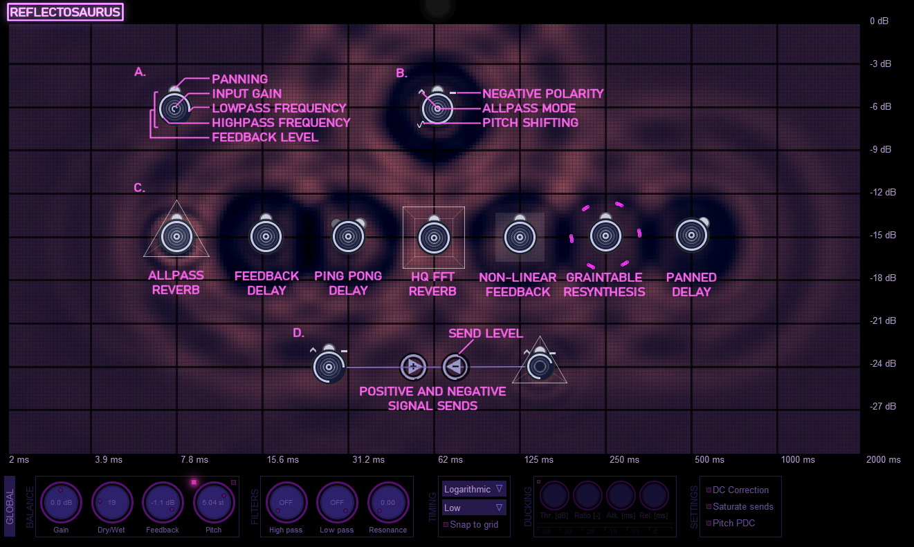

<i>Figure 1: Reflectosaurus' user interface. The big area at the top provides a visual overview of all the active feedbacks and reverbs (indicated by circular nodes). The horizontal axis reflects time, and the vertical axis reflects gain.</i>

Any delay chain in Reflectosaurus is made up of nodes. Depending on the node type, each node either indicates a feedback delay, an allpass reverb or an FFT reverb. Each of these can have various additional properties which are all reflected by visible cues in the **node area**.

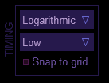

<i>Figure 2: Reflectosaurus has two modes of operation. Free and tempo-synced. Free mode is more amenable to constructing spatial early reflections and reverbs whereas tempo-synced is more amenable to musical delays. In free mode, the horizontal axis reveals a logarithmic scale, allowing for precise timing for both low and high values, whereas sync mode shows a linear scale with the grid being shown in beats.</i>

The node area has two axes: the horizontal or **time axis** which indicates the delay time (or beats in sync mode, see Figure 2), and the vertical or **gain axis** which indicates how much that node contributes to the output. The location of a node therefore determines its delay time, as well as its output gain. Clicking a node selects it and shows its parameters in the **control area** (see Figure 3).

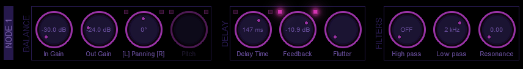

<i>Figure 3: Basic controls of a feedback node.</i>

## 2. Node types

### Feedback Node

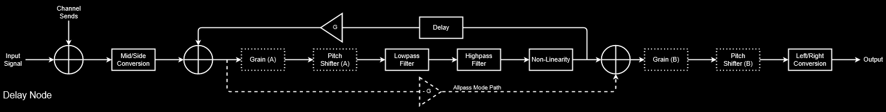

<i>Figure 4: Feedback node signal chain. The dotted boxes are optional locations for those signal processors respectively. The dotted allpass line is only active in allpass mode.</i>

Let's start by considering the most common node first: The feedback node (depicted in Figure 1a and 3). Each node is depicted by a little circle, the size of which indicates how large its delay feedback is, or, in the case of a reverb, its decay time. The size of a node can be altered by clicking it with the right mouse button and dragging.

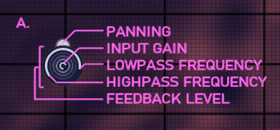

<i>Figure 5: Node layout. Most of the settings of a node are directly controllable with the mouse or keyboard. You can modify feedback level (RMB + drag), modify input level (mousewheel), change lowpass frequency (shift + drag), highpass frequency (Ctrl + shift + drag) and adjust panning (Alt + drag). You can also Mute (M), Solo (S), toggle ping-pong delay (P), feedback inversion (I) and toggle non-linearity (R).</i>

The center of the circle indicates how high the input gain is. This refers to the gain directly coming from the audio source going into the plugin. It can be adjusted with the scroll wheel. Each node has a lowpass and highpass filter and the frequencies that are allowed to pass are indicated by the outer white arc. Finally, the panning is indicated by the nodule at the tip. In case of panning, this nodule moves left or right. In case of a ping pong delay, it splits in two, with the initial delay in the ping-pong having a brighter color.

Feedback nodes can be set to various operation modes. These can be toggled using the LEDs in the **control area**.

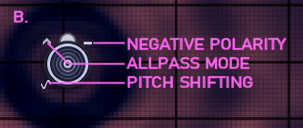

<i>Figure 6: Different feedback node modes.</i>

**Negative polarity**: This mode can be toggled in the control area or by entering I. When this mode is activate the node uses negative feedback instead of positive feedback.

**Allpass mode**: Not to be confused with the allpass reverb node, an allpass feedback delay uses an allpass structure rather than a normal feedback delay structure. The allpass structure includes a feedforward chain (see Figure X).

### A little more on feedback types
Feedbacks are an efficient way of spreading out sound over time, by modifying a single pulse, into a sequence of pulses. To understand this, consider what happens if a spike enters the three feedback structures we've seen so far (see Figure X). What we see for all three is that they spread the audio over time. A single pulse, is turned into a pulse with multiple echos (optionally changing sign/polarity along the way).

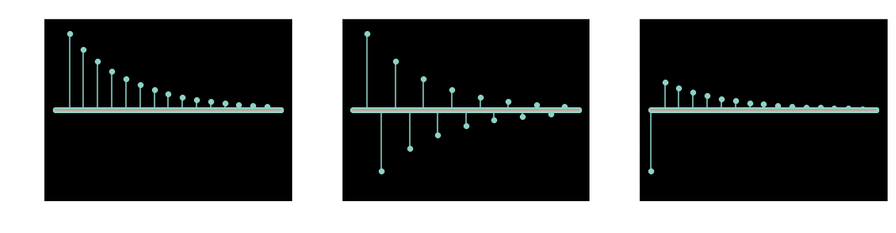

<i>Figure 7: Result of the three feedback structures to a single sample audio 'impulse'. </i>

If the delay time is short, such a feedback is often interpreted as the sound being more diffuse in nature. As such, feedback structures are likely candidates for reverberation algorithms.

Let's consider the frequency domain for a moment. If we look at the response of such feedback loops to white noise with a flat spectrum, we start seeing different responses for each of these delay set ups. When feedback delay times get short and feedback gains high, distinct comb filtering effects start to appear (see Figure 5). For positive feedback, these appear at multiples of the inverse of the delay time (i.e. for 10 milliseconds of delay, emphasis occurs at 100 Hz, 200 Hz, etc). For negative feedback, the pattern changes, and the initial emphasis occurs at half the fundamental and then at 3x, 5x, 7x this frequency, producing odd harmonics. As such, negative feedback in this setup leads to odd harmonics being emphasized.

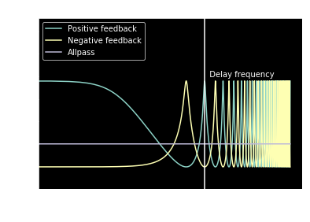

<i>Figure 8: Frequency spectrum for short feedback times. </i>

Allpass filters are special in the sense that they do not lead to this comb-like frequency response, but to a completely flat frequency response. For this reasons, allpass delays are frequently used in reverbation algorithms. They provide a very basic phenomenological model of the diffuse reflection of sound while not overly coloring the sound.

This sounds good, but it comes with a caveat. When we look at the frequency response of an allpass delay in this way, we consider the frequency response of the entire time window. In this time window, we observe that all frequencies are let through with unit gain, but this does not mean that they are all let through at the same phase. In fact, some frequencies arrive earlier, and others later. When constructing reverbs out of multiple allpasses, it can still occur that allpass reverbs can sound somewhat metallic because the comb effects are inherently still there. This is especially apparent when using short impulsive sounds where the decay of the chain can be heard.

### Allpass Reverb Node

While a single allpass delay might not sound very good, they can sound rather pleasant when put into an overarching feedback loop containing multiple allpasses. Considering that this would be quite a hassle to do with individual nodes, Reflectosaurus provides a shortcut for setting up such a feedback system. 

Any feedback node can be converted to a reverb node by clicking the little LED on the top left of the delay time. 

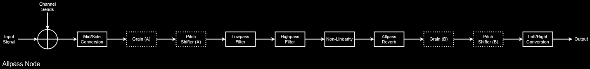

<i>Figure 9: Allpass node signal chain. The dotted boxes are optional locations for those signal processors respectively.</i>

Allpass reverb nodes have just two reverb settings, size and decay as indicated in Figure 4. Internally, the reverb node contains 10 allpass filters linked together in an overarching feedback loop.

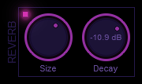

<i>Figure 10: Allpass reverb module options with its basic parameters size and decay. Some plugins refer to size as diffusion.</i>

<i>Note: Allpass Reverb nodes are more CPU hungry than simple delay nodes, as internally they are comprised of a multitude of feedback allpass delays. They can however provide richness when it is needed.</i>

### FFT Reverb Node

Sometimes the metallic qualities of allpass reverbs are not acceptable, or you happen to be looking for a wider, flatter sound. For these times, there is also a single specialized node with an FFT Reverb included. This reverb has a high quality sound, but comes at a fairly high CPU cost. It also has some considerable latency.

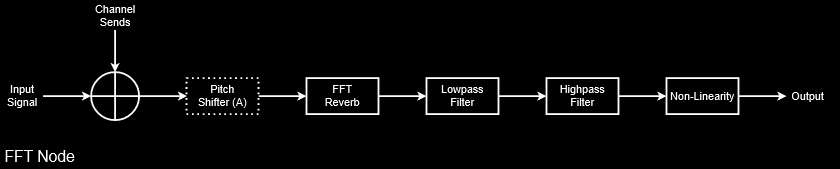

<i>Figure 11: FFT node signal chain. The dotted box indicates that the pitch shifter is optional.</i>

The FFT node takes the incoming signal, determines its spectrum and adds the magnitude spectrum to a running tally called the energy buffer. This energy buffer is gradually emptied over time (the speed of which is controlled by the decay parameter) and it is used to resynthesize the sound with a randomized phase. What this results in is extremely wide reverb that sounds quite lush.

In addition to regular reverb operation controllable by the decay parameter, it also has a shine parameter that adds high frequency shimmer via octave doubling.

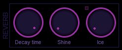

<i>Figure 12: FFT Reverb module options. Decay controls the reverb time, shine controls how much shimmer is added and ice controls the addition of small spectral peaks.</i>

The final FFT reverb parameter ice performs small spectral cuts and copies them to higher frequencies, providing an icy sprinkle of sound. Note that since the reverb does not have a time parameter, it does not respond to changes in its X coordinate on the grid.

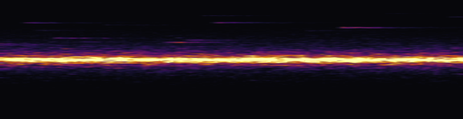

<i>Figure 13: The effect of ice on the sonogram. The horizontal axis reflects time, the y-axis reflects frequency whereas the colour indicates the amplitude. Input here was bandpassed white noise (bright bar down the middle). The thin spectral peaks at higher frequencies were due to the ice effect.</i>

## 3. Routing / Sends
This is where things get more complicated and potentially dangerous, but read on, because living dangerously is a lot more fun. Routing allows you to send audio from one node to another, potentially constructing complex feedback loops.

Holding Shift + LMB and then clicking and dragging from one node to another connects these two nodes via a send. By default, the polarity of a send is positive, but double clicking the send arrow can make it negative.

The magnitude of a send can be changed by clicking on the little arrow with the left mouse button and dragging. You'll notice that the outer arc of the send change when you do this.

Sends are resolved with a one sample latency in order to not have to solve implicit equations. In practice, this does not matter much, since for most nodes, the sends go straight into the delay buffer of the receiving node, adding even more delay. The only difference is the allpass node (*not* the allpass reverb node); as these contain a feedforward straight to the audio output. As such, send constructions involving allpass nodes are the most prone to blowups.

One thing to notice from Figure 5 (the comb filter graph) is that despite the feedback gain being clamped to 1 (0 dB), the gain for individual frequencies can be higher than one (> 0 dB). This means that nodes with high feedback are not necessarily stable when linked into larger structures with other nodes. This is something to keep in mind when using sends. Feedback loops with sends are not necessarily unconditionally stable and can blow up.

*Note: With feedback comes great responsibility as circular feedbacks with the correct phase shifts can potentially cause blowups.*

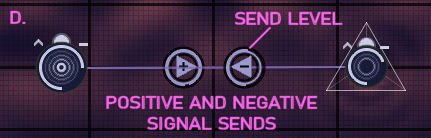

<i>Figure 14: An example of a positive and negative send. Polarity can be changed via double clicking the arrow. The level can be altered by clicking and dragging the arrow. Note the little arc around the arrow indicatikng the send level.</i>

One option available in Reflectosaurus is to enable send saturation. Send saturation is one of the global plugin settings and saturates the sends preventing them from blowing up completely. Send saturation can be used to simulate howl-round feedback loops and other self oscillating phenomena.

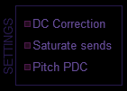

<i>Figure 15: Settings found in the global settings panel. DC Correction corrects input DC, which can be critical for stability when using sends. Saturate sends saturates all signals coming into a node together.</i>

## 4. Saturation
Each node can incorporate one non-linear effect into its feedback system. This non-linearity is located after the filters. Most of these shapers are static waveshapers, but some have a dynamic component. Please read below for more information.

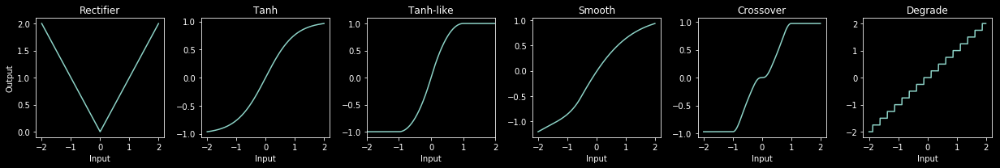

<i>Figure 16: List of available static waveshapers.</i>

The following effects are basic static waveshapers. They are applied to the signal directly and lead to a relatively predictable set of harmonics.
* Rectify:
Rectifies the signal. This basically takes the absolute of the signal, doubling the frequencies in the source material and adding strong intermodulation between the frequencies present in the input signal.
* Tanh:
Evaluates the hyperbolic tangent for every incoming sample. This results in a very smooth distortion containing only odd harmonics.
* Tanh-like
Computationally cheaper approximation of the hyperbolic tangent shaper.
* Smooth:
Asymmetric waveshaper which introduces both even and odd harmonics. Since asymmetric waveshapers result in a DC offset, a high pass is applied after the waveshaper. Note that this can cause some subtle phase shifts at low frequencies.
* Crossover Distortion:
An exaggerated model of crossover distortion. Leads to odd harmonics.
* Degrader
Quantizes the incoming signal.

There are also two non-linear effects available:

* Slew Limiter
A slew limiter. This non-linear effect amplifies the signal by a large value, then applies a non-linear waveshaper (tanh) on the derivative of the signal. This acts as a form of dirty lowpass which also introduces some harmonics (but no phase shifts).
* Octaver Down:
This waveshaper flips every odd period of the wave. For a pure sine wave this would lead to halving the frequency and generating some extra harmonics from the induced sudden transitions.

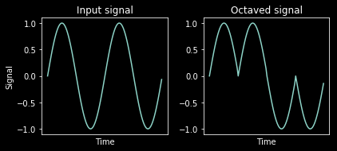

<i>Figure 17: Effect of the octaver on the signal. we can see how it would reduce the fundamental frequency of a pure sound by half. It's effect on sounds with a more complex timbre is hard to predict.</i>

### Strength
The effect of the strength parameter is context dependent. For saturation-style non-linear effects, it dials in the saturation more extremely. It does this by pre-amplifying the audio before it enters the non-linearity and correcting for this amplification after the non-linearity, thereby effectively squashing it. For the others, it has the following effects:

- Rectify: No effect
- Degrader: Reduces the bitdepth.
- Slew limiter: Limit more strongly (reduces high frequencies)
- Octaver: Mix in more of the octave down signal.

### Warmth
Sometimes, the effects of waveshaping can rob a sound of its warmth. In order to mitigate this, there is a warmth control present on the waveshaper. It applies a tilt filter which removes some of the low frequencies prior to applying the non-linear effect, only to apply the inverse filter post-shaping.

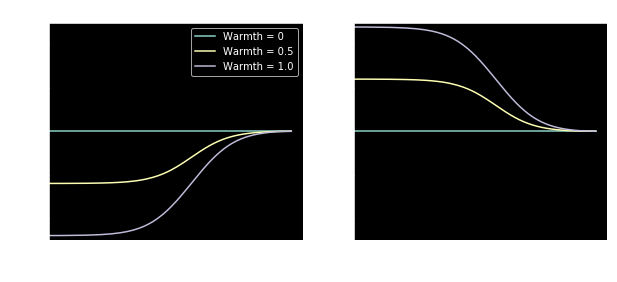

<i>Figure 18: Shelf filters used for the warmth control.</i>

## 5. Ducking
While delays can really fill out empty places in a mix, they can also crowd and intefere with your melodies. To avoid this, it is often a good idea to apply sidechain compression to the delay channel. To facilitate this, Reflectosaurus includes a sidechain compressor on the global strip by default. It can be activated by clicking the little LED on the top left of the unit (see Figure X). The sidechain compressor reduces the volume of the delays whenever audio is coming in.

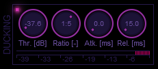

<i>Figure 19: A small sidechain compressor included in Reflectosaurus.</i>

## 6. Pitch shifting
The plugin supports pitch shifting of both nodes as well as the global output. When pitch shifting using the knobs in the **control area** *note that holding both mouse buttons while dragging snaps the pitch to semitones*.

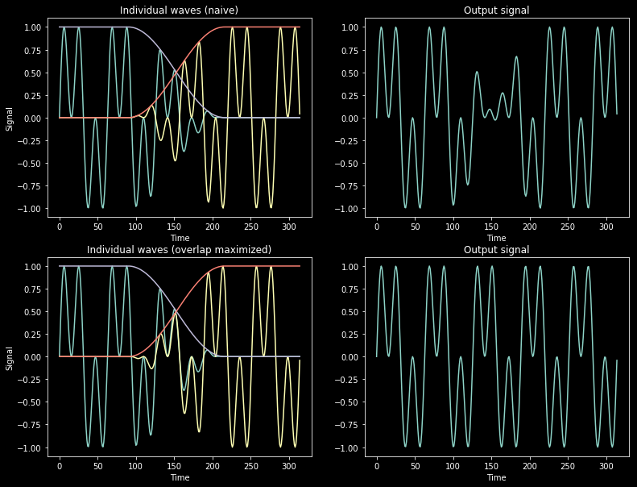

<i>Figure 20. Top: Amplitude modulation-like effects due to phase cancellation when phases are not appropriately matched. The signals for the two windows are shown in green and yellow, while the crossfade envelopes are shown in gray and red. The summed signal is shown on the right, showing disasterous phase cancellation. In the bottom panel we see the result when we maximize the overlap in the crossfade region. The phases are matched, and the sum is much closer to the desired result.</i>

Pitch shifting makes use of a relatively simple algorithm named Waveform Similarity and Overlap Add (WSOLA). It works by generating small windows of audio which can be played back at a higher or lower speed (thereby adjusting the pitch).

The problem with this approach is that in the regions where the individual windows are being crossfaded, phase cancellation can occur. This is illustrated in Figure 5. This is undesireable since it generates a ring-modulation-like sound which can easily be audible. The WSOLA algorithm tries to mitigate this by computing the autocorrelation function between consecutive grains and using this to calculate a buffer offset needed to maximize the overlap of the waveforms in the crossfade region.

While this algorithm provides a reasonably usable real-time pitch shifter, the algorithm is not well suited to pitching down drums, as the overlap searching can lead to audible stuttering effects. It can also have problems with wide stereo content, as finding an overlap which works for both channels at the same time can be problematic.

## 7. Grain table resynthesis

Similarly to the pitch shifter, the grain module windows small segments of audio and plays these back. Unlike the pitch shifter, the aim of graintable resynthesis is not fidelity to the source material, but creatively reassembling the source material.

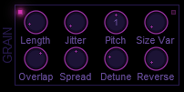

<i>Figure 21: Graintable resynthesis panel.</i>

A single grains is characterized by a length, a playback rate, a play direction and panning. Each of these properties are controlled indirectly via the controls on the node strip.
- `Length` controls the average length of a grain.
- `Size Var` controls the randomization of this length.
- `Overlap` controls the number of grains playing at once. Higher overlap, produces a smoother sound.
- `Jitter` controls the positional randomization of the playhead on the delay buffer. Increasing the `Jitter` spreads out the area over which grains are sourced. 
- `Pitch` and `Detune` work as expected, with the former controlling the average pitch and the latter controlling the pitch randomization.
- `Reverse` controls the probability of a grain playing in reverse rather than forward.

## 8. Advanced Operation

### Pitch following

Delay nodes can be set to a **pitch following** mode. This mode is rather special and allows you to tune the delay time to incoming MIDI notes. Enabling **pitch following** only makes sense in the non-sync mode. It can be enabled by clicking the LED on the top right of the Delay Time. When doing this, you'll notice that the displayed value changes to a note. This is the note corresponding to the frequency of the delay. Changing the delay time with the dial allows you to change the note now. *Holding both LMB and RMB while dragging makes the delay time snap to that particular note.*

Once set to perform pitch following, the plugin will respond to incoming MIDI nodes and retune those notes for which pitch following is enabled. You can use this to make interesting sounds as the generated resonances will be pitched accordingly. A good example of this is the preset "*Unusual degradation 2 [keytracked]*".